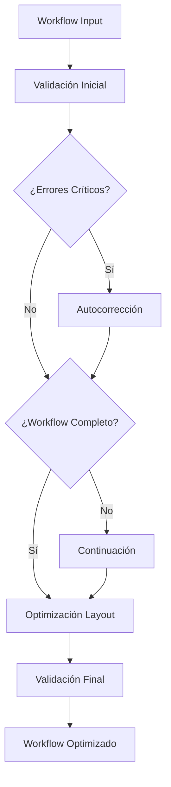

# 📚 DOCUMENTACIÓN DEL SISTEMA MODULAR INTEGRADO V3.0+

## 🚀 Arquitectura del Sistema

El **n8n AI Assistant** ha sido completamente modernizado con una arquitectura modular que integra **4 componentes principales extraídos y modernizados** junto con el ecosistema de agentes existente.

### 🏗️ Componentes Principales

#### 1. **Sistema de Continuación V3.0** (`workflow-continuation-system-v3.js`)
- **Propósito**: Extender workflows truncados o incompletos de manera inteligente
- **Características**:
  - Análisis de completitud automático
  - Extensión en múltiples fases
  - Estrategias de continuación adaptables
  - Integración con Gemini AI
  - Sistema de tracking de extensiones

#### 2. **Autocorrector V4.0** (`workflow-autocorrector-v4.js`)
- **Propósito**: Corrección automática e inteligente de errores en workflows
- **Características**:
  - Base de datos expandida de correcciones
  - Soporte para nodos LangChain
  - Corrección de parámetros avanzada
  - Sistema de tracking de correcciones
  - Integración con IA para correcciones contextuales

#### 3. **Validador Inteligente V5.0** (`intelligent-workflow-validator-v5.js`)
- **Propósito**: Validación completa y avanzada de workflows
- **Características**:
  - Validación estructural, de conectividad y configuración
  - Análisis específico para workflows de IA
  - Verificación de seguridad y rendimiento
  - Sistema de scoring inteligente
  - Sugerencias de optimización automática

#### 4. **Optimizador de Layout V3.0** (`layout-optimizer-v3.js`)
- **Propósito**: Posicionamiento profesional y optimizado de nodos
- **Características**:
  - Algoritmo Sugiyama para minimización de cruces
  - Sistema de swimlanes con clústers semánticos
  - Configuración dinámica por densidad
  - Nodos virtuales para arcos largos
  - Centrado automático y equilibrio del lienzo

## 🔧 Integración en Extension Server

### Inicialización
```javascript
// Los módulos se inicializan automáticamente en el constructor de N8nAIAssistant
this.continuationSystem = new WorkflowContinuationSystem({
  geminiApiKey: process.env.GEMINI_API_KEY,
  debugMode: true
});

this.workflowAutocorrector = new WorkflowAutocorrector({
  geminiApiKey: process.env.GEMINI_API_KEY,
  enableLangChainSupport: true,
  debugMode: true
});

this.modernValidator = new IntelligentWorkflowValidator({
  enableAIValidation: true,
  enablePerformanceCheck: true,
  enableSecurityCheck: true
});

this.layoutOptimizer = new LayoutOptimizer({
  debugMode: true,
  enableAIOptimization: true,
  layoutStyle: 'AI_OPTIMIZED'
});
```

### Métodos Disponibles

#### `continueWorkflow(workflowData, originalPrompt, options)`
Extiende un workflow existente basándose en el prompt original.
```javascript
const result = await assistant.continueWorkflow(workflow, prompt, {
  maxPhases: 3,
  extensionStrategy: 'adaptive'
});
```

#### `autocorrectWorkflow(workflowData, originalPrompt, options)`
Corrige automáticamente errores detectados en el workflow.
```javascript
const result = await assistant.autocorrectWorkflow(workflow, prompt, {
  enableLangChainCorrections: true,
  strictMode: false
});
```

#### `validateWorkflowModern(workflowData, originalPrompt, options)`
Realiza validación completa con análisis avanzado.
```javascript
const result = await assistant.validateWorkflowModern(workflow, prompt, {
  enableAIValidation: true,
  enableSecurityCheck: true
});
```

#### `optimizeWorkflowLayout(workflowData, clusterManifest, options)`
Optimiza el posicionamiento visual de los nodos.
```javascript
const result = await assistant.optimizeWorkflowLayout(workflow, null, {
  layoutStyle: 'AI_OPTIMIZED',
  enableSwimlaneClustering: true
});
```

#### `processWorkflowComplete(workflowData, originalPrompt, options)`
**Método principal** que ejecuta todo el pipeline de procesamiento:
1. Validación inicial
2. Autocorrección (si es necesario)
3. Continuación (si está truncado)
4. Optimización de layout
5. Validación final

```javascript
const result = await assistant.processWorkflowComplete(workflow, prompt, {
  enableContinuation: true,
  enableAutocorrection: true,
  layoutStyle: 'AI_OPTIMIZED'
});
```

## 📊 Estructura de Respuestas

### Respuesta del Sistema de Continuación
```javascript
{
  success: true,
  extendedWorkflow: { nodes: [...], connections: {...} },
  phases: 2,
  extensionStrategy: 'adaptive',
  originalNodeCount: 5,
  addedNodeCount: 8,
  metadata: {
    version: '3.0',
    timestamp: '2024-...',
    processingTime: 1250
  }
}
```

### Respuesta del Autocorrector
```javascript
{
  success: true,
  correctedWorkflow: { nodes: [...], connections: {...} },
  correctionsApplied: 12,
  correctionTypes: ['parameter_correction', 'connection_fix', 'langchain_update'],
  qualityScore: 95,
  metadata: {
    version: '4.0',
    timestamp: '2024-...'
  }
}
```

### Respuesta del Validador
```javascript
{
  isValid: true,
  score: 92,
  criticalErrors: [],
  warnings: ['Nodo X podría optimizarse'],
  suggestions: ['Considerar añadir nodos de memoria'],
  optimizations: [
    {
      type: 'suggestion',
      category: 'ai',
      suggestion: 'Añadir manejo de errores'
    }
  ],
  analysisDetails: {
    structure: { hasNodes: true, nodeStructureValid: true },
    connectivity: { hasTriggers: true, noOrphans: true },
    aiSpecific: { hasAINodes: true, hasMemoryManagement: true }
  }
}
```

### Respuesta del Layout Optimizer
```javascript
{
  success: true,
  workflow: { nodes: [...], connections: {...} },
  metrics: {
    totalNodes: 15,
    swimlanesCreated: 3,
    optimizationScore: 88,
    processingTime: 890,
    crossingsBefore: 12,
    crossingsAfter: 3
  }
}
```

## 🎯 Casos de Uso

### Caso 1: Workflow Incompleto
```javascript
// Prompt: "Crear sistema de email marketing"
// Workflow generado: Solo tiene trigger + email
// El sistema detecta incompletitud y extiende automáticamente
const result = await assistant.processWorkflowComplete(workflow, prompt);
// Resultado: Workflow completo con segmentación, personalización, analytics
```

### Caso 2: Workflow con Errores
```javascript
// Workflow tiene conexiones rotas y parámetros faltantes
const result = await assistant.autocorrectWorkflow(workflow, prompt);
// Resultado: Workflow corregido con conexiones válidas y parámetros completos
```

### Caso 3: Workflow de IA Complejo
```javascript
// Workflow con múltiples nodos LangChain
const result = await assistant.validateWorkflowModern(workflow, prompt, {
  enableAIValidation: true
});
// Resultado: Análisis detallado de configuración de IA y sugerencias
```

### Caso 4: Layout Desordenado
```javascript
// Workflow con nodos mal posicionados
const result = await assistant.optimizeWorkflowLayout(workflow);
// Resultado: Layout profesional con swimlanes y cruces minimizados
```

## ⚙️ Configuración Avanzada

### Variables de Entorno
```bash
# Requeridas
GEMINI_API_KEY=your_api_key_here

# Opcionales
ENABLE_V4_ULTRA=true
DEBUG_MODE=true
LAYOUT_STYLE=AI_OPTIMIZED
ENABLE_CONTINUATION=true
ENABLE_AUTOCORRECTION=true
```

### Opciones de Configuración

#### Sistema de Continuación
```javascript
{
  maxPhases: 5,                    // Máximo número de fases de extensión
  extensionStrategy: 'adaptive',   // 'conservative', 'adaptive', 'aggressive'
  enableContextAnalysis: true,     // Análisis de contexto del prompt
  debugMode: false                 // Logging detallado
}
```

#### Autocorrector
```javascript
{
  enableLangChainSupport: true,    // Soporte para nodos LangChain
  strictMode: false,               // Modo estricto de corrección
  maxCorrections: 50,              // Máximo número de correcciones
  enableAICorrections: true        // Correcciones basadas en IA
}
```

#### Validador Inteligente
```javascript
{
  enableAIValidation: true,        // Validación específica de IA
  enablePerformanceCheck: true,    // Análisis de rendimiento
  enableSecurityCheck: true,       // Verificación de seguridad
  strictMode: false                // Modo estricto de validación
}
```

#### Layout Optimizer
```javascript
{
  layoutStyle: 'AI_OPTIMIZED',     // 'MINIMAL', 'STANDARD', 'SPACIOUS', 'AI_OPTIMIZED'
  enableAIOptimization: true,      // Optimizaciones específicas para IA
  debugMode: false,                // Logging detallado
  strictClustering: false          // Clustering estricto de nodos
}
```

## 📈 Métricas y Monitoreo

### Tracking de Rendimiento
Cada módulo incluye sistemas de tracking que proporcionan métricas detalladas:

```javascript
// Obtener estadísticas de todos los módulos
const stats = {
  continuation: assistant.continuationSystem.getStats(),
  autocorrector: assistant.workflowAutocorrector.getStats(),
  validator: assistant.modernValidator.getStats(),
  layoutOptimizer: assistant.layoutOptimizer.getStats()
};
```

### Métricas Disponibles
- **Tiempo de procesamiento** por módulo
- **Scores de calidad** de workflows
- **Número de correcciones** aplicadas
- **Optimizaciones de layout** realizadas
- **Cache hit rates** para mejor rendimiento

## 🔄 Pipeline de Procesamiento Completo

El método `processWorkflowComplete()` ejecuta el siguiente pipeline:



## 🚀 Ventajas del Sistema Modular

1. **Separación de Responsabilidades**: Cada módulo tiene un propósito específico
2. **Mantenibilidad**: Código organizado y fácil de mantener
3. **Escalabilidad**: Fácil añadir nuevos módulos
4. **Testabilidad**: Cada módulo puede probarse independientemente
5. **Reutilización**: Los módulos pueden usarse en otros proyectos
6. **Configurabilidad**: Cada módulo es altamente configurable
7. **Rendimiento**: Cache y optimizaciones a nivel de módulo

## 🔧 Troubleshooting

### Problemas Comunes

#### Error: "Module not found"
```bash
# Asegurar que todos los archivos están en el directorio correcto
ls -la workflow-continuation-system-v3.js
ls -la workflow-autocorrector-v4.js
ls -la intelligent-workflow-validator-v5.js
ls -la layout-optimizer-v3.js
```

#### Error: "GEMINI_API_KEY not found"
```bash
# Configurar la API key
echo "GEMINI_API_KEY=your_key_here" >> .env
```

#### Workflow no se optimiza correctamente
```javascript
// Verificar configuración del layout optimizer
const result = await assistant.optimizeWorkflowLayout(workflow, null, {
  debugMode: true,
  layoutStyle: 'AI_OPTIMIZED'
});
```

## 📝 Conclusión

El sistema modular integrado V3.0+ proporciona una arquitectura robusta, escalable y mantenible para el n8n AI Assistant. Cada módulo aporta funcionalidades específicas que, trabajando en conjunto, ofrecen una experiencia completa de generación, validación, corrección y optimización de workflows.

La integración mantiene la compatibilidad con sistemas existentes mientras añade capacidades avanzadas que mejoran significativamente la calidad y profesionalismo de los workflows generados.