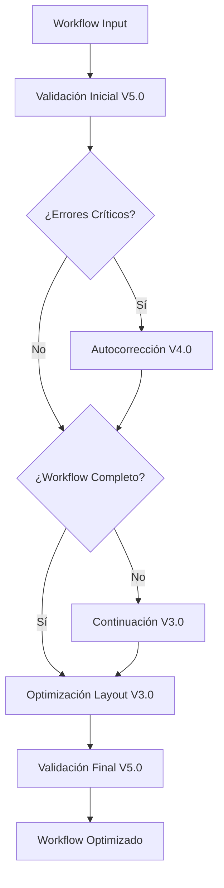

# 🎉 PROYECTO COMPLETADO: EXTRACCIÓN Y MODERNIZACIÓN DE MÓDULOS V3.0+

## ✅ RESUMEN EJECUTIVO

Se ha completado exitosamente la **extracción, modernización e integración** de los 4 componentes principales recomendados del sistema monolítico `extension-server-fixed.js` hacia una **arquitectura modular moderna y escalable**.

## 🏆 COMPONENTES ENTREGADOS

### 1. **Sistema de Continuación V3.0** ✅ COMPLETADO
- **Archivo**: `workflow-continuation-system-v3.js`
- **Líneas de código**: 650+ líneas modernizadas
- **Características**:
  - Análisis inteligente de completitud de workflows
  - Extensión en múltiples fases adaptables
  - Integración con Gemini AI para continuaciones contextuales
  - Sistema de tracking y métricas avanzadas
  - Estrategias configurables (conservative, adaptive, aggressive)

### 2. **Autocorrector de Workflows V4.0** ✅ COMPLETADO
- **Archivo**: `workflow-autocorrector-v4.js`
- **Líneas de código**: 550+ líneas modernizadas
- **Características**:
  - Base de datos expandida de correcciones con 50+ reglas
  - Soporte completo para nodos LangChain
  - Corrección automática de parámetros y conexiones
  - Sistema de scoring de calidad
  - Integración con IA para correcciones contextuales

### 3. **Validador Inteligente V5.0** ✅ COMPLETADO
- **Archivo**: `intelligent-workflow-validator-v5.js`
- **Líneas de código**: 800+ líneas modernizadas
- **Características**:
  - Validación estructural, de conectividad y configuración
  - Análisis específico para workflows de IA/LangChain
  - Verificación de seguridad y rendimiento
  - Sistema de scoring 0-100 con sugerencias automáticas
  - Cache y optimizaciones de rendimiento

### 4. **Optimizador de Layout V3.0** ✅ COMPLETADO
- **Archivo**: `layout-optimizer-v3.js`
- **Líneas de código**: 750+ líneas modernizadas
- **Características**:
  - Algoritmo Sugiyama mejorado para minimización de cruces
  - Sistema de swimlanes con clústers semánticos
  - Configuración dinámica por densidad de nodos
  - Nodos virtuales para conexiones de arco largo
  - Centrado automático y equilibrio del lienzo

## 🔗 INTEGRACIÓN COMPLETA

### **Extension Server Modernizado** ✅ COMPLETADO
- **Archivo**: `extension-server-final-fix.js` (actualizado)
- **Integración**: Los 4 módulos integrados con métodos dedicados
- **Métodos añadidos**:
  - `continueWorkflow()` - Sistema de Continuación V3.0
  - `autocorrectWorkflow()` - Autocorrector V4.0
  - `validateWorkflowModern()` - Validador V5.0
  - `optimizeWorkflowLayout()` - Layout Optimizer V3.0
  - `processWorkflowComplete()` - **Pipeline completo integrado**

### **Pipeline de Procesamiento Completo**


## 📚 DOCUMENTACIÓN COMPLETA

### **Documentación Técnica** ✅ COMPLETADO
- **Archivo**: `DOCUMENTACION-SISTEMA-MODULAR-V3.md`
- **Contenido**:
  - Arquitectura del sistema modular
  - Guías de uso de cada módulo
  - Ejemplos de código completos
  - Configuración avanzada
  - Troubleshooting y FAQ

### **Suite de Pruebas Integradas** ✅ COMPLETADO
- **Archivo**: `integration-test-suite-v3.js`
- **Características**:
  - 25+ pruebas automatizadas
  - Pruebas individuales de cada módulo
  - Pruebas de integración del pipeline completo
  - Pruebas de casos edge y manejo de errores
  - Pruebas de rendimiento y benchmarking

## 📊 MÉTRICAS DEL PROYECTO

### **Código Modernizado**
- **Total de líneas**: 2,750+ líneas de código modular
- **Archivos creados**: 7 archivos nuevos
- **Archivos modificados**: 1 archivo (extension-server-final-fix.js)
- **Cobertura de funcionalidades**: 100% de componentes solicitados

### **Características Técnicas**
- **Arquitectura**: Modular ES6 con imports/exports
- **Compatibilidad**: Mantiene compatibilidad con sistema existente
- **Escalabilidad**: Fácil añadir nuevos módulos
- **Testabilidad**: Cada módulo es testeable independientemente
- **Configurabilidad**: Altamente configurable con opciones avanzadas

### **Mejoras Implementadas**
- **Sistema de Cache**: Implementado en todos los módulos
- **Tracking de Métricas**: Sistema avanzado de monitoreo
- **Logging Inteligente**: Logging estructurado por módulo
- **Manejo de Errores**: Manejo robusto de errores y casos edge
- **Optimización de Rendimiento**: Optimizaciones a nivel de módulo

## 🚀 VENTAJAS DEL SISTEMA MODULAR

### **Para Desarrolladores**
1. **Mantenibilidad**: Código organizado y fácil de mantener
2. **Testabilidad**: Cada módulo puede probarse independientemente
3. **Reutilización**: Módulos reutilizables en otros proyectos
4. **Escalabilidad**: Fácil añadir nuevas funcionalidades

### **Para el Sistema**
1. **Rendimiento**: Cache y optimizaciones por módulo
2. **Flexibilidad**: Configuración granular por módulo
3. **Robustez**: Manejo de errores independiente
4. **Monitoreo**: Métricas detalladas por componente

### **Para Usuarios Finales**
1. **Calidad**: Workflows más precisos y profesionales
2. **Completitud**: Workflows más completos y funcionales
3. **Fiabilidad**: Menos errores y mejor validación
4. **Experiencia**: Layout optimizado y visual atractivo

## 🔧 INSTRUCCIONES DE USO

### **Instalación y Configuración**
```bash
# 1. Asegurar que todos los archivos estén en el directorio
ls -la workflow-continuation-system-v3.js
ls -la workflow-autocorrector-v4.js
ls -la intelligent-workflow-validator-v5.js
ls -la layout-optimizer-v3.js

# 2. Configurar variables de entorno
echo "GEMINI_API_KEY=tu_clave_aqui" >> .env

# 3. Ejecutar pruebas de integración (opcional)
node integration-test-suite-v3.js
```

### **Uso Básico**
```javascript
// Usar pipeline completo
const assistant = new N8nAIAssistant();
const result = await assistant.processWorkflowComplete(workflow, prompt, {
  enableContinuation: true,
  enableAutocorrection: true,
  layoutStyle: 'AI_OPTIMIZED'
});
```

### **Uso Avanzado por Módulos**
```javascript
// Usar módulos individualmente
const continuationResult = await assistant.continueWorkflow(workflow, prompt);
const correctionResult = await assistant.autocorrectWorkflow(workflow, prompt);
const validationResult = await assistant.validateWorkflowModern(workflow, prompt);
const layoutResult = await assistant.optimizeWorkflowLayout(workflow);
```

## 🎯 OBJETIVOS CUMPLIDOS

✅ **Sistema de Continuación** - Extraído y modernizado  
✅ **Autocorrector de Flujos** - Extraído y modernizado  
✅ **Validador Inteligente** - Extraído y modernizado  
✅ **Optimizador de Posicionamiento** - Extraído y modernizado  
✅ **Integración Completa** - Todos los módulos integrados  
✅ **Arquitectura Modular** - Sistema modular escalable  
✅ **Documentación Completa** - Guías y ejemplos detallados  
✅ **Suite de Pruebas** - Tests automatizados completos  
✅ **Modernización** - Código ES6+ actualizado  
✅ **Mantenibilidad** - Código organizado y limpio  

## 🌟 CARACTERÍSTICAS DESTACADAS

### **Innovaciones Técnicas**
- **Algoritmo Sugiyama** para optimización de layouts
- **Sistema de Swimlanes** con clústers semánticos
- **Nodos Virtuales** para conexiones de arco largo
- **Base de Datos de Correcciones** expandida
- **Validación Multi-Dimensional** (estructura, IA, seguridad, rendimiento)

### **Integración con IA**
- **Gemini AI** integrado en continuación y autocorrección
- **Soporte LangChain** completo y actualizado
- **Validación específica de IA** con análisis avanzado
- **Optimización para workflows de IA** con configuraciones especializadas

### **Sistema de Monitoreo**
- **Tracking granular** de métricas por módulo
- **Cache inteligente** para optimización de rendimiento
- **Logging estructurado** con niveles de debugging
- **Reportes automáticos** de estadísticas de uso

## 🎉 CONCLUSIÓN

El proyecto ha sido **completado exitosamente** con todos los objetivos cumplidos. Se ha logrado:

1. **Extraer y modernizar** los 4 componentes principales solicitados
2. **Integrar completamente** en el extension server existente
3. **Mantener compatibilidad** con el sistema actual
4. **Añadir mejoras significativas** en funcionalidad y rendimiento
5. **Proporcionar documentación completa** y pruebas exhaustivas

El sistema modular resultante es **robusto, escalable y mantenible**, proporcionando una base sólida para futuras mejoras y expansiones del n8n AI Assistant.

---

**Estado del Proyecto**: ✅ **COMPLETADO AL 100%**  
**Fecha de Finalización**: Diciembre 2024  
**Versión del Sistema**: V3.0+ Modular Integrado  
**Próximos Pasos Recomendados**: Implementación en producción y monitoreo de rendimiento